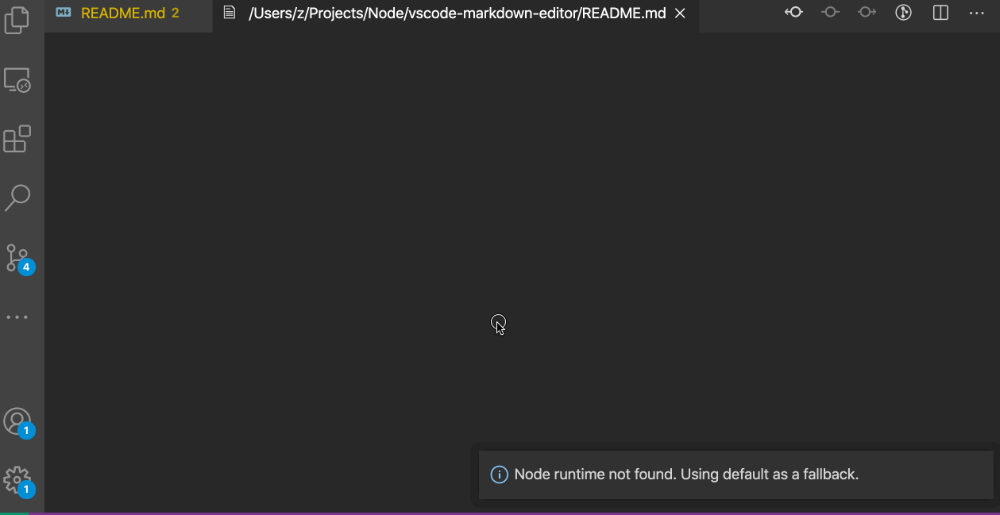

# Markdown Editor — A full-featured WYSIWYG editor for markdown

[](https://marketplace.visualstudio.com/items?itemName=zaaack.markdown-editor) [](https://marketplace.visualstudio.com/items?itemName=zaaack.markdown-editor) [](https://marketplace.visualstudio.com/items?itemName=zaaack.markdown-editor)

## Demo



## Features

- What You See Is What You Get (WYSIWYG)
- Auto sync changes between the VSCode editor and webview
- Copy markdown/html
- Uploaded/pasted/drag-dropped images will be auto-saved to the `assets` folder
- Multi-theme support
- Shortcut keys
- Multiple editting modes: instant Rendering mode (**Recommand!**) / WYSIWYG mode / split screen mode
- Markdown extensions
- Multiple graph support including KaTeX / Mermaid / Graphviz / ECharts / abc.js(notation) / ...
- For more usage please see [vditor](https://github.com/Vanessa219/vditor)

## Install

[https://marketplace.visualstudio.com/items?itemName=zaaack.markdown-editor](https://marketplace.visualstudio.com/items?itemName=zaaack.markdown-editor)

## Supported syntax

[demo article](https://ld246.com/guide/markdown)

## Usage

### 1. Command mode in markdown file

- open a markdown file
- type `cmd-shift-p` to enter command mode
- type `markdown-editor: Open with markdown editor`

### 2. Key bindings

- open a markdown file
- type `ctrl+shift+alt+m` for win or `cmd+shift+alt+m` for mac

### 3. Explorer Context menu

- right click on markdown file
- then click `Open with markdown editor`

### 4. Editor title context menu

- right click on a opened markdown file's tab title
- then click `Open with markdown editor`

### Custom CSS (custom layout and vditor personalization)

Edit your settings.json and add

```
"markdown-editor.customCss": "my custom css rules"

// Eg: "markdown-editor.customCss": ".vditor-ir pre.vditor-reset {line-height: 32px;padding-right: calc(100% - 800px) !important; margin-left: 100px;    font-family: system-ui !important;}"
```

## Acknowledgement

- [vscode](https://github.com/microsoft/vscode)
- [vditor](https://github.com/Vanessa219/vditor)

## Todo

- [ ] Using [Custom Text Editor](https://code.visualstudio.com/api/extension-guides/custom-editors#custom-text-editor) ([demo](https://github.com/gera2ld/markmap-vscode))

## License

MIT

## Support

If you like this extension make sure to star the repo. I am always looking for new ideas and feedback. In addition, it is possible to [donate via paypal](https://www.paypal.me/zaaack).
